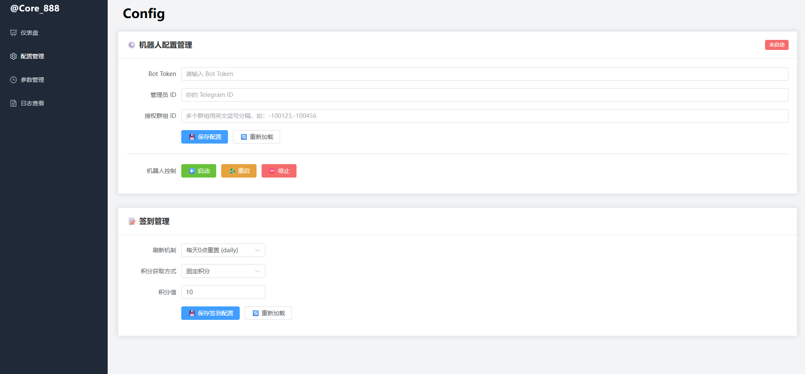
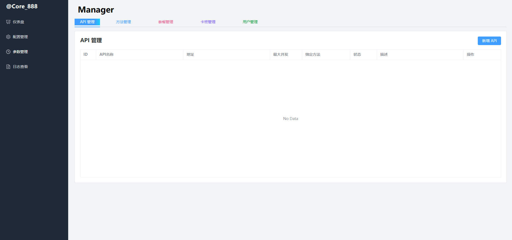

# CoreBot TelegramBot + Web可视化管理 一体 

## 此版本仅为demo 看情况会后续更新

一套基于 Fastify + Vue3 + Element-Plus 的机器人服务管理系统  
前后端分离，支持 API 管理、方法管理、套餐管理、卡密管理、用户管理等功能。
同时机器人在线运行启动

---

## 目录结构
/backend # Node.js Fastify 后端（接口、数据层等）          
/backend/bot # Node.js 机器人   
/frontend/bot_web # Vue3 前端工程（Element-Plus、Tailwind、Vite）      
/database # Sequelize 数据模型      
/config # 配置文件（config/default.json等）    

---





## 快速部署

### 1. 克隆项目

```bash
git clone <your-git-repo>
cd <your-project-root>
```

### 2. 安装依赖


```node
cd backend
npm install
```

### 3. 如何启动

直接 node index.js即刻 默认外网开放 可以在Config里修改 
